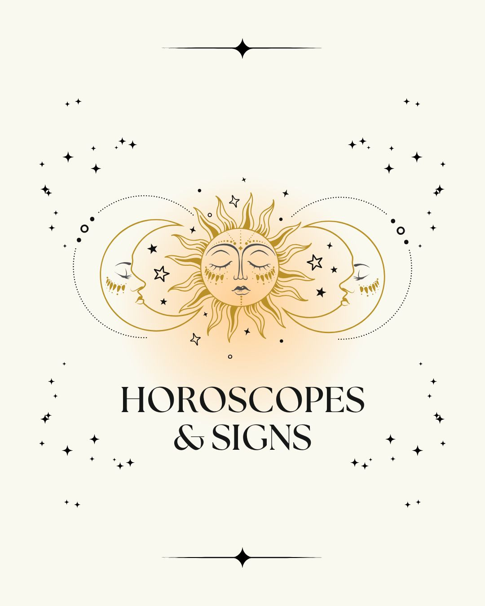
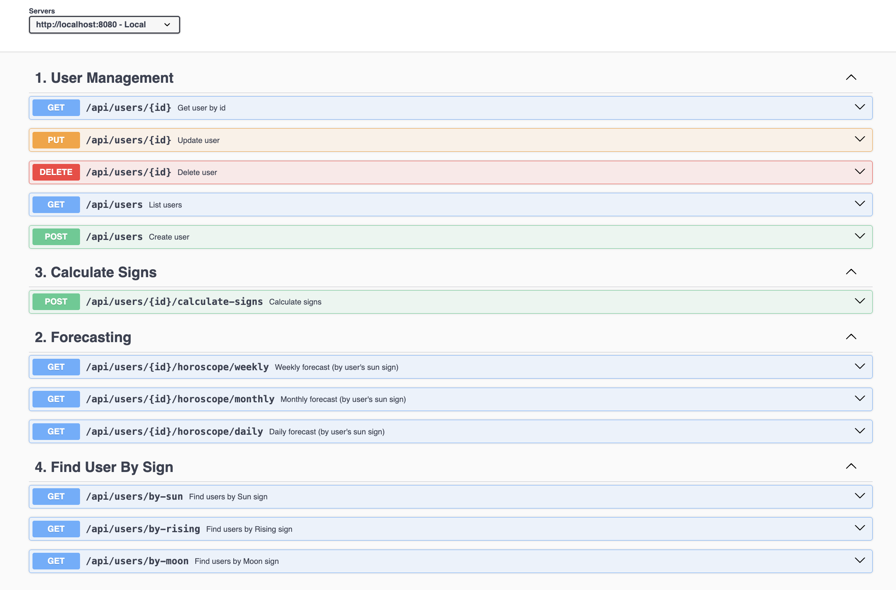

<div align="center">
  
  <h1>Horoscope API</h1>
  <p>Calculate your Sun/Moon/Rising signs and find you daily/weekly/monthly forecasts.</p>

  <a href="https://img.shields.io/badge/LANGUAGE-JAVA-brightgreen">
    
  </a>

  ___
</div>

_Please read all the way through before starting_

### ✨ Features

- User management (create, read, update, delete)
- Find Sun sign from date of birth
- Calculate Sun/Moon/Rising via external service
- Find daily/weekly/monthly forecasts for a user’s Sun sign
- Filter and find users by Sun/Moon/Rising sign

### ✨ Tech Stack 
- Java 21
- Maven
- Spring Boot
- Spring Data JPA
- MySQL
- Swagger OpenAPI
- JUnit 5
- Jackson (ObjectMapper)
- RestTemplate/HTTP

### ✨ API Documentation

- Swagger UI (make sure API is running)

 ```
http://localhost:8080/swagger-ui/index.html
 ```

 ### ✨ Swagger 
<div align="center">
  
</div>

### ✨ Testing 
- To run all tests run:
```
**./mvnw clean test**
```

To run the SunSignCalculatorTest alone:
```
**./mvnw -Dtest=SunSignCalculatorTest test**
```

To run UserServiceTest alone: 
```
** ./mvnw -Dtest=UserServiceTest test**
```

### ✨ Setting Up
- Clone the Horoscope API

```
git clone <https://github.com/amihami/horoscope-api>
cd horoscope-api
```

- Build
./mvnw clean install

- Run the API (available at http://localhost:8080)
    - mac
```
./mvnw spring-boot:run
```

    - Windows 
    - Linux

### ✨ API Endpoints 
<sub>(_all requests JSON_)</sub>

1. Create User
- POST /api/users

2. Calculate Signs (STRICT payload)
- POST /api/users/{id}/calculate-signs

3. Forecasts (by user’s Sun sign)
- GET /api/users/{id}/horoscope/daily
- GET /api/users/{id}/horoscope/weekly
- GET /api/users/{id}/horoscope/monthly

4. Find Users by Sign (JPA filters)
- GET /api/users/by-sun?sign=Aries
- GET /api/users/by-moon?sign=Cancer
- GET /api/users/by-rising?sign=Libra


### ✨ Important to Note
- The endpoint /calculate-signs has a strict payload enforced to ensure the accuracy of sign calculations.
    - All fields under subject are _required_
    - For the fields _hour_ and _minute_, only integers values are excepted. Make sure there are no leading zeros.
    - E.g. If born 03:07 AM → "hour": 3, "minute": 7 ✅ not "hour": 03, "minute": 07 ❌
    - Be sure to use a valid IANA timezone, e.g. Europe/London, Africa/Nairobi.
        -  Reference: https://en.wikipedia.org/wiki/List_of_tz_database_time_zones
- Forecast responses are cleaned for punctuation/ligatures to improve readability.
- Use Swagger UI to try requests interactively and see request/response schemas.

### ✨ Happy Forcasting ✨
